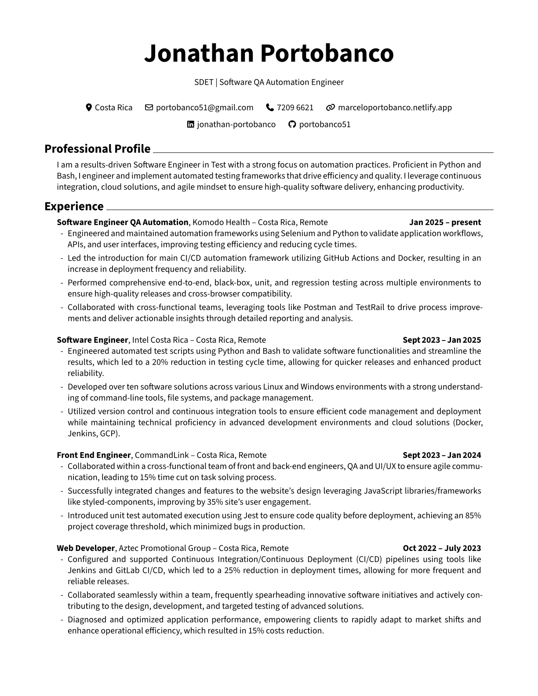
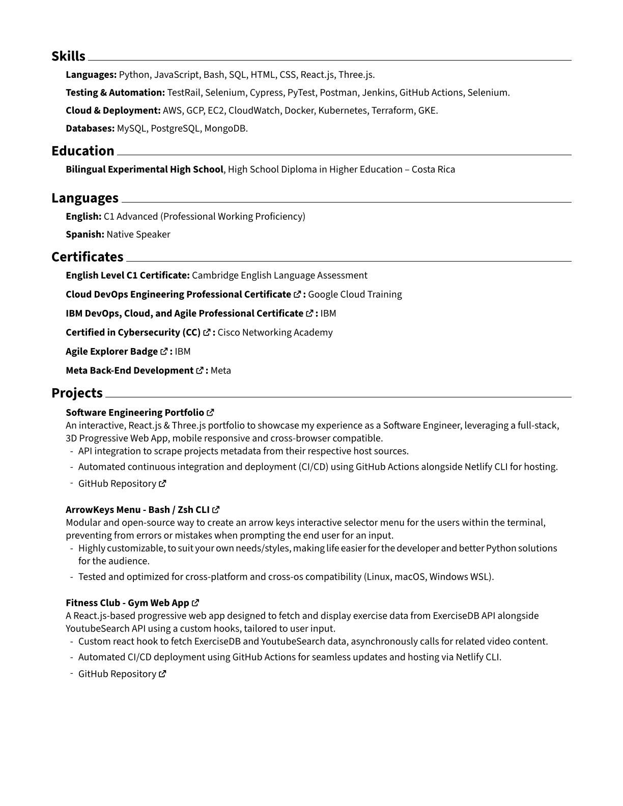

# RenderCV

## Description

<p>RenderCV is a tool designed to generate high-quality CVs from YAML configuration files. It allows users to customize their CVs easily and render them in various formats.</p>

<p>I've created this repository to provide a version control system for my resume using YAML structure. Feel free to use the theme and modify it to your liking.</p>

## Usage

1. **Install Dependencies**: Ensure you have the necessary dependencies installed. You can do this by running:

    ```bash
    pip install -r requirements.txt
    ```

2. **Prepare Your YAML File**: Create a YAML file (e.g., `QA_CV.yaml`) that contains your resume information. The structure of the YAML file should follow the specifications outlined in the documentation.

3. **Render Your Resume**: Use the following command to render your resume:

    ```bash
    rendercv render <path_to_your_yaml_file>
    ```

    For example:

    ```bash
    rendercv render ./QA_CV.yaml
    ```

4. **Output**: The rendered resume will be saved in the `rendercv_output` directory.

## Rendered Resume

Here's a preview of the rendered resume:

<table style="width: 100%;">
  <tr>
    <td style="width: 50%;">
      
    </td>
    <td style="width: 50%;">
      
    </td>
  </tr>
</table>

## Contributing or Suggestions

Contributions and suggestions are welcome! Please submit a pull request or open an issue for any enhancements.

## License

This project is licensed under the GNU General Public License - see the [LICENSE](LICENSE) file for details.
